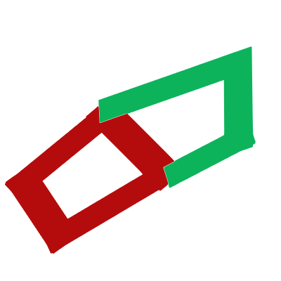

# sneedCode </img>
Inspired by VSCode but with a different workflow and can be ran without server software or electron. (No, seriously! Just open the HTML page in any Chromium-based browser to open sneedCode!) Made to look familiar.

All stable releases will be released at [the releases page.](https://github.com/Sneed-Group/sneedcode/releases)

Made with <3 by Sneed Group.
